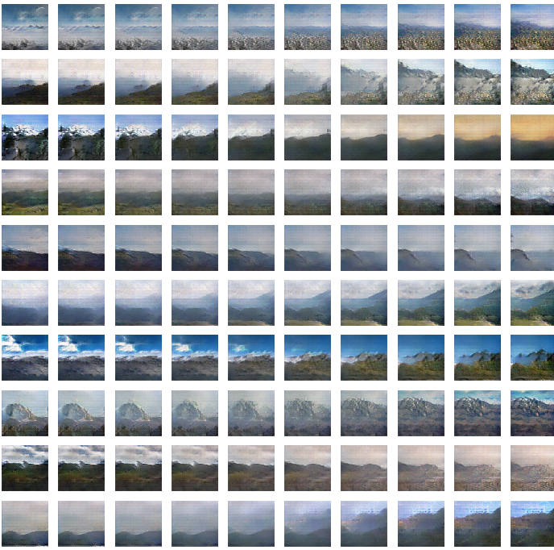
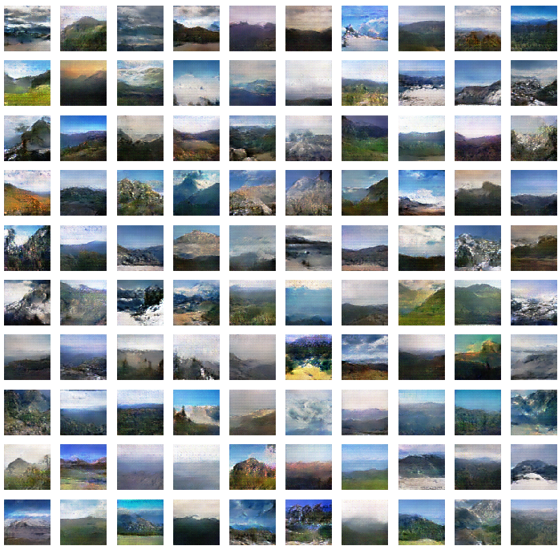

# Mountain Generation with DCGAN

### 1. Architecture


The generator and discriminator models that were used are directly taken from the Radford et al DCGAN paper. Learning rates were kept at their suggested values of 0.0002 for both neural nets, and a $\beta_1$ value of 0.5 was applied for the Adam optimizer used in the generator. These values provided a near-constant mean loss of 1 for both the discriminator and the generator during training.

In addition to the tips suggested in the DCGAN paper, one-sided label smoothing was applied with Tensorflow's built-in binary cross-entropy loss.

```python
cross_entropy = tf.keras.losses.BinaryCrossentropy(from_logits=False, label_smoothing=0.4)
```

### 2. Walking in Latent Space

A point in the Latent space is used as input for the generator to create images of mountains. By walking through this latent space, intermediate images should have some features of mountains. If they are random and incoherent, then this is an indicator that the model is memorizing the training images, rather than generalizing. Here you can see the images are gradually changing with respect to the mountains and are not nonsense in between.



### 3. Generated Images

1000 epochs (5 hours):

